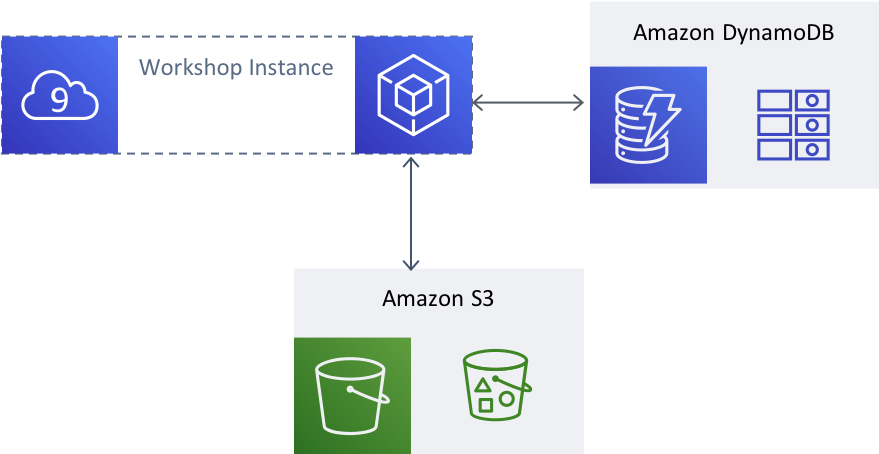
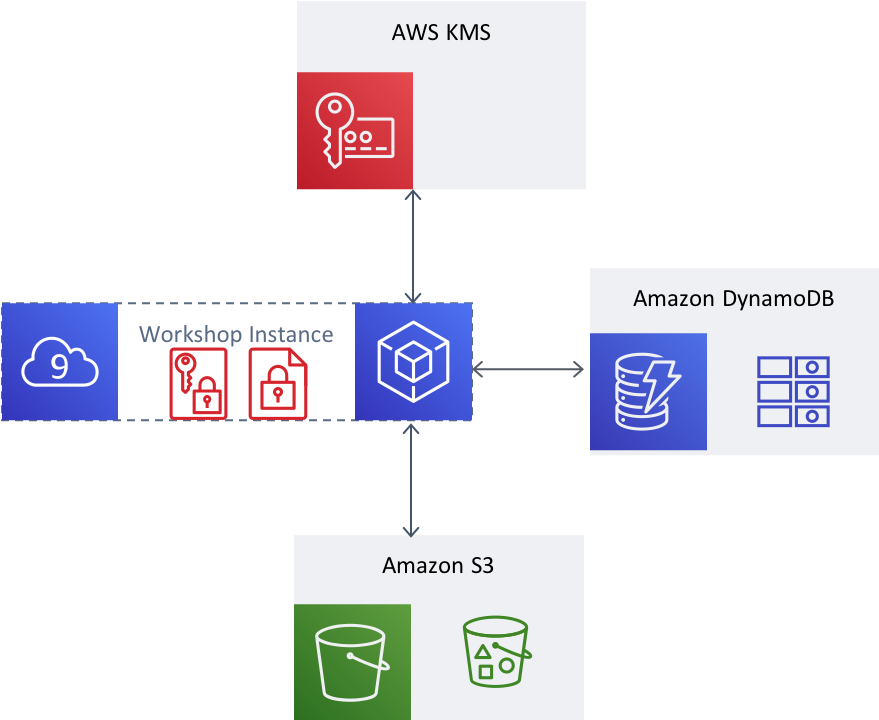

# The Busy Engineer's Document Bucket

Welcome to the Busy Engineer's Document Bucket workshop. In this workshop, you will be guided through adding client-side encryption with KMS and the AWS Encryption SDK. Each exercise has step-by-step instructions. Each exercise also has a `-complete` version available to use as a reference.

## Background: The Document Bucket System

The example system you will will work on is the Document Bucket. As you begin this workshop, this system uses DynamoDB and S3 to `store`, `search`, `list`, and `retrieve` documents with associated metadata. The bodies of each document are written as S3 objects. DynamoDB maintains a pointer to that object, along with associated metadata for that object. Additionally, DynamoDB is set up to maintain records of tags used to identify the document, so that you can search for documents that match a particular tag.

After your work in the workshop is complete, you will have added client-side encryption with the AWS Encryption SDK and AWS KMS to the Document Bucket. Before data leaves the origin instance in `store`, it will be encrypted client-side. After the data is `retrieve`d, it will be decrypted client side with a permissions check and audit entry from AWS KMS. You will also explore options for binding and validating the metadata to the object.

## Exercises

In this workshop, you will work through the following modules:

1. Using the AWS Encryption SDK
1. Adding multiple Master Keys to your encryption
1. Using Encryption Context

## Getting Started

Ready to start? Proceed to [Getting Started](./getting-started.md) to begin.
